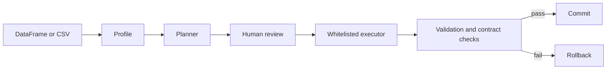

# MAS-DS

MAS-DS is a local, deterministic multi-expert orchestration system for
explainable dataframe and CSV preprocessing. It profiles data, proposes typed
cleaning operations, requires review, validates candidate results, and rolls
back changes that fail safety or error-level data-contract checks.

The project is research and portfolio software, not a guarantee of correct or
regulation-compliant data processing. Review every cleaning plan before
execution and every output before downstream use.

## Main use case

MAS-DS helps inspect and conservatively repair common tabular-data issues:

- duplicate rows and missing values;
- numeric text and advisory IQR outlier flags;
- categorical case and narrowly evidenced typo normalization;
- text whitespace;
- strongly evidenced datetime conversion;
- schema and semantic requirements expressed as Data Contracts.

It supports in-memory pandas workflows and transactional chunked CSV processing.

## Key features

- Rule-based, local Ollama, hybrid, graph, and deterministic Multi-Expert planners.
- RouterAgent plus six bounded specialists: duplicate, missing-value, numeric,
  categorical, text, and datetime experts.
- CriticAgent review and conservative Arbiter plan assembly.
- Typed Pydantic `CleaningPlan`, policy, contract, trace, provenance, validation,
  and transaction models.
- Protected identifier columns and user-defined protected-column policy.
- Pre-cleaning and post-cleaning semantic validation.
- Validation-driven rollback and atomic same-filesystem chunked output replacement.
- Read-only Streamlit orchestration trace with JSON and Markdown export.
- Value-free audit provenance using deterministic SHA-256 fingerprints.
- Seeded routing evaluation, baselines, ablations, and bundled public-dataset checks.
- No arbitrary generated-code execution.

## Architecture



Multi-Expert planning makes the decision stages explicit:

```text
DataFrame + DataProfile
  -> RouterAgent
  -> bounded specialist proposals
  -> CriticAgent
  -> Arbiter
  -> CleaningPlan
  -> existing approval/execution/validation/rollback path
```

| Component | Responsibility |
|---|---|
| RouterAgent | Assigns observed column or dataset issues to suitable specialists while excluding protected columns. |
| DuplicateExpert | Proposes exact duplicate-row removal. |
| MissingValueExpert | Proposes conservative median/mode filling or `leave_unchanged`. |
| NumericExpert | Proposes lossless numeric conversion and non-mutating outlier flags. |
| CategoricalExpert | Proposes conservative case or typo normalization when evidence exists. |
| TextExpert | Proposes bounded whitespace cleanup. |
| DatetimeExpert | Proposes conversion only with strong, lossless datetime evidence. |
| CriticAgent | Rejects protected, unknown, redundant, conflicting, or unsafe proposals. |
| Arbiter | Deduplicates and deterministically assembles an executor-compatible plan. |

Specialists only propose typed operations. They never modify the dataframe and
never produce executable source code.

## Data Contracts, validation, and rollback

Optional JSON-serializable Data Contracts support required, optional, protected,
nullable, typed, range-constrained, allowlisted, unique, regex-constrained,
datetime-bounded, and text-length-constrained columns. Warning findings are
reported without forcing rollback. Remaining error findings after cleaning cause
the existing validation path to return the original dataframe.

Example:

```json
{
  "name": "Orders contract",
  "schema_version": "1.0",
  "required_columns": ["order_id", "amount"],
  "protected_columns": ["order_id"],
  "columns": {
    "order_id": {"nullable": false, "unique": true},
    "amount": {
      "allowed_dtypes": ["number"],
      "nullable": false,
      "numeric_min": 0,
      "severity": "error"
    },
    "region": {
      "allowed_values": ["APAC", "EMEA", "LATAM", "North America"],
      "severity": "warning"
    }
  }
}
```

Contract content is parsed as data and cannot select paths, import modules, or
execute code.

## Chunked and atomic CSV processing

Chunked processing profiles and transforms bounded chunks while preserving
cross-chunk duplicate tracking, global fill values, and streaming contract
validation. Processed rows are written to a unique staging file beside the final
destination. MAS-DS validates the complete staged CSV and commits with
`os.replace` only after success. An existing destination remains unchanged until
that replacement.

```powershell
python -m scripts.run_chunked_preprocessing `
  --input data\samples\customers_dirty.csv `
  --output outputs\chunked_customers_cleaned.csv `
  --chunk-size 10000
```

Atomic replacement relies on same-filesystem rename guarantees. File locks,
permissions, full disks, abnormal process termination, and unusual network
filesystems can still prevent a commit.

## Installation

Python 3.11 or newer is declared. The publication audit and full suite were run
with Python 3.13.11; other declared versions were not exercised during that audit.

```powershell
git clone <repository-url>
cd MAS_DS
python -m venv .venv
.\.venv\Scripts\Activate.ps1
python -m pip install -e ".[dev,evaluation]"
```

Core dependencies are NumPy, pandas, Pydantic, LangGraph, and Streamlit.
scikit-learn is optional for bundled public-dataset evaluation. Ollama is an
optional separately installed local service; LangChain and paid/cloud SDKs are
not core requirements.

## Quick start

Start the UI:

```powershell
python -m streamlit run app.py
```

Then select a sample or upload a local CSV, choose **Rule-based baseline** or
**Multi-Expert**, optionally select a Data Contract, review the proposed plan,
and approve it only if the operations are appropriate for the dataset.

For Multi-Expert mode, open **Multi-Expert Orchestration Trace** to inspect the
Router decisions, specialist proposals, Critic decisions, and Arbiter-selected
steps. The viewer is read-only and does not bypass approval or validation.

## CLI and evaluation examples

Run a rule-based experiment:

```powershell
python -m evaluation.run_experiment --methods rule --seeds 0 1 2
```

Run the routing and ablation suite without overwriting an existing result folder:

```powershell
python -m evaluation.multi_expert_evaluation `
  --output-dir outputs\multi_expert_evaluation_run `
  --seeds 0 1 2 3 4
```

Run the bundled public-dataset benchmark when the evaluation extra is installed:

```powershell
python -m evaluation.real_dataset_benchmark --output-dir outputs\real_dataset_benchmark
```

All deterministic modes and evaluation tools run locally and require no API key.
Local Ollama modes are optional and are not needed for tests or evaluation.

## Evaluation methodology and measured results

Ground truth is declared independently from Router output. The latest reviewed
run used five seeds, 110 scenarios, and 770 ablation runs. It included synthetic
corruptions, clean/protected controls, contract-protected cases, mixed issues,
and small datasets bundled with scikit-learn.

| Metric | Measured value |
|---|---:|
| Routing macro F1 | 0.6818 |
| Routing micro F1 | 0.3802 |
| False-routing rate | 0.7629 |
| Missed-routing rate | 0.0417 |
| Protected-column exclusion accuracy | 1.0000 |
| Clean-dataset routing no-op accuracy | 0.0000 |
| NumericExpert precision | 0.1282 |
| CategoricalExpert precision | 0.0732 |
| Full Multi-Expert detection F1 | 0.5714 |
| Rule-baseline detection F1 | 0.5165 |
| Full Multi-Expert labeled repair success | 1.0000 |
| Rule-baseline labeled repair success | 0.8636 |
| Oracle-router detection F1 | 0.9806 |

These results show improved labeled repair coverage over the rule baseline in
this suite, but they do **not** show an optimal Router. Numeric and categorical
experts are activated too broadly, producing low precision, a high false-routing
rate, and zero clean-dataset routing no-op accuracy. Oracle routing identifies
routing selectivity as the largest measured opportunity.

Removing the Critic or Arbiter did not change aggregate repair on naturally
generated bounded proposals. Their safety contribution appeared in controlled
unsafe/conflict fixtures, and full orchestration provided the complete trace.
No statistical-significance claim is made. Synthetic labels, small bundled
datasets, operation-coverage repair proxies, and machine-dependent latency limit
generalization.

Reviewed, value-free result summaries are in
[`evaluation/results/public/`](evaluation/results/public/).

## Testing

```powershell
python -m pytest -q
```

The latest publication audit passed 201 tests. Tests are deterministic and do
not require internet access, paid APIs, Ollama, or a live Streamlit server.

## Security and privacy

- Data processing is local in Rule-based and Multi-Expert modes.
- No arbitrary LLM-generated code is executed.
- Raw dataframe cells are excluded from provenance and orchestration metadata.
- Protected columns are checked at multiple planning and validation boundaries.
- `.env`, Streamlit secrets, local outputs, logs, virtual environments, uploads,
  generated reports, and temporary staging files are excluded from publication.
- Processed CSV downloads necessarily contain processed data and remain the
  user's responsibility.

See [SECURITY.md](SECURITY.md). These controls reduce risk; they do not guarantee
privacy, semantic correctness, or suitability for sensitive production data.

## Project structure

```text
agents/        planners, Router, specialists, Critic, Arbiter, validation
models/        typed Pydantic contracts and result models
tools/         profiling, execution, contracts, provenance, reports, chunking
workflow/      graph-based approval, execution, validation, commit, rollback
evaluation/    datasets, metrics, benchmarks, ablations, public summaries
scripts/       local command-line entry points
data/samples/  small deterministic synthetic CSV examples
tests/         deterministic unit, integration, rollback, and safety tests
docs/          architecture, contract, chunking, benchmark, and E2E guides
```

## Documentation

- [Data Contracts](docs/DATA_CONTRACTS.md)
- [Chunked preprocessing and atomic output](docs/CHUNKED_PREPROCESSING.md)
- [Multi-Expert orchestration](docs/MULTI_EXPERT_ORCHESTRATION.md)
- [Multi-Expert evaluation](docs/MULTI_EXPERT_EVALUATION.md)
- [Streamlit E2E checklist](docs/STREAMLIT_E2E_CHECKLIST.md)
- [Real dataset benchmark](docs/REAL_DATASET_BENCHMARK.md)
- [Demo script](docs/DEMO_SCRIPT.md)
- [Large-dataset stress-test methodology](docs/LARGE_DATASET_STRESS_TEST.md)
- [Release notes](docs/RELEASE_NOTES.md)
- [Contributing](CONTRIBUTING.md)
- [Security policy](SECURITY.md)

## License and disclaimer

Released under the [MIT License](LICENSE).

The software is provided without warranty. It is not a substitute for domain
review, data governance, privacy assessment, security review, or regulatory
validation. Always retain an independent backup and inspect proposed and
processed data before use.
