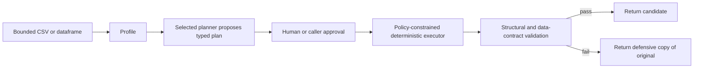

# MAS-DS

MAS-DS is a local, policy-constrained data-cleaning application for CSV and
pandas dataframes. It proposes typed cleaning operations, requires explicit
approval in the UI, executes only a fixed operation allowlist, validates the
candidate result, and returns the original dataframe when validation requires
rollback.

It is portfolio and research software. It is not production-ready, is not a
hosted multi-tenant service, and does not guarantee that a cleaning decision is
semantically correct.

## Implemented planner modes

1. **Rule-based baseline** — deterministic heuristics with no model dependency.
2. **Deterministic routed planner** — a fixed local Router/rule-specialist/review
   pipeline with an inspectable trace. Despite the internal historical class
   names, this is not a genuine multi-agent system.
3. **Local Ollama model** — one bounded structured-output model proposal.
4. **Hybrid rule + Ollama** — deterministic rules plus a bounded model proposal,
   with deterministic fallback when the model endpoint fails.

All modes produce a typed `CleaningPlan`. A planner cannot execute Python,
shell commands, SQL, arbitrary code, or dataframe mutations. Only deterministic
application code may approve and execute allowlisted operations; contract
validation and rollback are never delegated to a model.

## Privacy and model endpoints

Ollama-compatible endpoints are loopback-only by default. Non-loopback HTTP(S)
destinations require explicit UI opt-in. URLs containing credentials are
rejected.

Model planning sends:

- column names and aggregate profile metadata;
- the configured model name;
- zero sample rows by default.

Users may explicitly enable up to three bounded sample rows in the UI. Those
cell values are then transmitted to the displayed configured endpoint. Do not
enable samples or a remote endpoint for data you are not authorized to
transmit. Prompts, rows, endpoint URLs, credentials, and full model responses
are not logged.

## In-memory limits

The Streamlit upload path accepts UTF-8 CSV files with these default maximums:

| Limit | Value |
|---|---:|
| Upload bytes | 10,000,000 |
| Rows | 100,000 |
| Columns | 200 |
| Header length | 128 characters |
| Cell length | 10,000 characters |
| Preview rows | 50 |
| Detailed diff rows | 1,000 |
| Report audit rows | 100 |

Empty, malformed, non-UTF-8, duplicate-header, and oversized inputs are
rejected before planning. Use the chunked CLI for larger files.

## Installation

Supported Python versions are 3.11 through 3.13.

```powershell
python -m venv .venv
.\.venv\Scripts\Activate.ps1
python -m pip install -c constraints-tested.txt -e ".[dev,evaluation]"
```

`constraints-tested.txt` records the versions verified locally. scikit-learn is
an optional evaluation dependency and was unavailable in the latest local test
run; its two benchmark tests therefore skipped.

`.env.example` is a shell-environment example. MAS-DS does not automatically
load `.env` files.

## Run

```powershell
python -m streamlit run app.py
```

Chunked processing:

```powershell
mas-ds-chunked `
  --input data\samples\customers_dirty.csv `
  --output outputs\customers_cleaned.csv
```

The equivalent repository command is:

```powershell
python -m scripts.run_chunked_preprocessing --help
```

## Execution model



The in-memory UI, experiments, and benchmarks use one authoritative lifecycle
in `agents/orchestrator.py`. The former fixed LangGraph duplicate was removed.

The chunked CLI has a specialized file transaction adapter: it writes a unique
sibling staging file, validates it, and calls `os.replace` only after success.
See [chunked processing](docs/CHUNKED_PREPROCESSING.md) for filesystem and
failure limitations.

## Evaluation

The canonical corruption evaluation retains a clean dataframe and a cell-level
corruption map. Metrics include:

- exact or explicitly tolerant corrupted-cell recovery;
- unaffected-cell preservation and false modification rate;
- protected-column modifications;
- unexpected row/column loss;
- schema preservation;
- planning precision/recall and rollback outcomes.

Selecting the expected operation is not counted as repair unless the resulting
value matches clean ground truth. The deterministic routed-planner benchmark
uses schema 2.0 and names its operation proxy
`expected_operation_coverage`; it is not a repaired-cell metric.

The reviewed public subset under `evaluation/results/public/` now uses schema
2.0 and contains aggregate artifacts only: 100 routing scenarios and 700
ablation runs across seven configurations and seeds 0–4. Scenario, prediction,
and run-level rows remain ignored review evidence. The routing
false/unnecessary-activation rate is approximately 0.716216 and clean-dataset
no-op accuracy is 0.0, so routing selectivity remains weak. Timings are
environment-specific and nondeterministic. These synthetic results do not prove
production quality, genuine multi-agent behavior, or repaired-cell correctness.

## Verification

Latest local offline run on 2026-07-25:

```text
229 passed, 2 skipped
```

The two skips were optional scikit-learn bundled-dataset tests. This result
verifies the assertions in that environment only; it is not proof of semantic
correctness, production safety, or model quality.

No external model endpoint is required for the offline suite.

## Exports

Processed CSV downloads preserve exact data values. Spreadsheet applications
may interpret cells beginning with formula characters; inspect untrusted data
before opening it. Audit CSV exports neutralize formula-like text because that
does not change the processed dataset. Markdown tables escape untrusted HTML
and table separators, and detailed audits are bounded.

## Deployment classification

MAS-DS is a **local single-user application**. It has no authentication,
authorization, tenant isolation, hosted retention/deletion service, public
rate limiting, or supported multi-user deployment configuration. Do not expose
it as a public service without a separate product and security design.

## Repository safety

The following remain local and ignored: `.env`, uploads, private/generated data,
`outputs/`, logs, `.venv/`, caches, databases, model weights, PDFs/DOCX files,
and `HAND_DS_BOOK/`. Ignored files still require manual privacy, copyright, and
credential review before publication or release.

## Documentation

- [Data contracts](docs/DATA_CONTRACTS.md)
- [Chunked processing](docs/CHUNKED_PREPROCESSING.md)
- [Evaluation limitations](docs/MULTI_EXPERT_EVALUATION.md)
- [Security policy](SECURITY.md)
- [Contributing](CONTRIBUTING.md)

## License

MIT. Review every plan and output before downstream use. Retain independent
backups and apply domain-specific governance for real user data.
