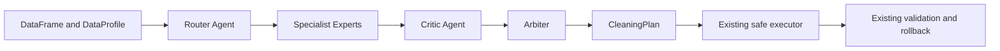

# Multi-Expert Agent Orchestration

MAS-DS includes an optional deterministic planner that makes expert
coordination explicit. `MultiExpertCleaningAgent` implements the existing
`CleaningPlanner` protocol, so it works with either existing orchestrator
without changing execution, approval, validation, rollback, chunked
processing, local LLM, hybrid, or rule modes.

## Architecture



Every planning stage produces structured, testable data. The planner stores
its latest `OrchestrationTrace`, containing routes, proposals grouped by
expert, the critic result, and the final plan. No planning stage executes code
or modifies the input dataframe.

## Router Agent

`RouterAgent` inspects the supplied `DataProfile` and dataframe evidence. Each
`RoutingDecision` records `column`, `selected_expert`, `issue_type`, `reason`,
and `confidence`.

Duplicates, missing values, numeric data, categorical data, text cleanup, and
strong datetime evidence are routed to their respective experts. Datetime
text is routed only when all observed values parse and either the column name
has date/time semantics or all values match an ISO-style date.

Identifier-like and policy-protected columns are not sent to a modifying
specialist. The router emits a visible `protected_identifier` decision with no
selected expert instead.

## Specialist Experts

Each specialist has a narrow boundary and returns only `CleaningStep`
proposals:

| Expert | Proposal boundary |
|---|---|
| `DuplicateExpert` | `drop_duplicates` for observed exact duplicates |
| `MissingValueExpert` | median/mode fill, or `leave_unchanged` for all-missing columns |
| `NumericExpert` | safe numeric-text conversion and non-mutating IQR flags |
| `CategoricalExpert` | observed case variants and conservative category typo repair |
| `TextExpert` | leading/trailing whitespace cleanup |
| `DatetimeExpert` | datetime conversion only with strong lossless evidence |

Experts cannot directly modify a dataframe or introduce operations outside
the existing Pydantic `CleaningStep` whitelist.

## Critic Agent

`CriticAgent` returns a `CriticResult` with `approved_steps`,
`rejected_steps`, `warnings`, and `reasons`. It rejects:

- changes to protected identifier columns;
- references to unknown columns;
- duplicate or redundant steps;
- competing fill strategies or competing type conversions;
- unsafe numeric or datetime conversion without strong evidence;
- fill operations on all-missing columns;
- category typo normalization without detected typo evidence;
- operations denied by preprocessing policy.

Safe sequences are not treated as conflicts. Lossless numeric conversion
followed by median fill, for example, remains valid.

## Arbiter

`Arbiter` accepts the critic output, deduplicates repeated operations, applies
a second conservative conflict check, and orders steps for the existing
executor. Conversion runs before numeric fill, and outlier flags run after
conversion. If unresolved competing fills or conversions reach the arbiter,
the conflicting changes are omitted. An explicit `leave_unchanged` proposal
wins over mutation.

The result is a normal `CleaningPlan`, so all existing execution and rollback
safeguards still apply.

## Data-contract safety

An optional typed `DataContract` adds semantic boundaries without changing the
expert execution model. Contract-protected columns merge into active policy
before routing. The Critic rejects conversions incompatible with allowed
semantic dtypes and avoids uncertain category rewriting when an allowlist is
active. The Arbiter still sees only approved proposals. The final plan is
validated against the same contract after execution, and remaining error-level
violations use the established rollback path. See `DATA_CONTRACTS.md`.

## Using the planner

```python
from agents.multi_expert import MultiExpertCleaningAgent
from agents.orchestrator import PreprocessingOrchestrator

planner = MultiExpertCleaningAgent()
orchestrator = PreprocessingOrchestrator(cleaning_agent=planner)
proposal = orchestrator.propose(dataframe)

# Inspect coordination before approval.
trace = planner.last_trace
print(trace.routes)
print(trace.specialist_proposals)
print(trace.critique)

outcome = orchestrator.execute_approved(
    dataframe,
    proposal.plan,
    run_id=proposal.run_id,
)
```

No internet, paid API, or LLM is used by this planner.

## Streamlit integration

Run the app and choose **Multi-Expert** under **Cleaning expert**:

```powershell
streamlit run app.py
```

The Cleaning plan tab contains a collapsed, read-only **Multi-Expert
Orchestration Trace** expander with four views:

1. **Router decisions** — column, selected expert, issue type, confidence, and
   evidence-based reason. Protected identifiers appear as not routed.
2. **Specialist proposal summary** — proposal count, operations, and columns
   grouped by expert, including experts that proposed no change.
3. **Critic review** — approved and rejected steps plus warnings and reasons.
4. **Arbiter final selected steps** — the exact final ordered steps passed into
   the normal approval and execution workflow.

The trace is stored with the cached proposal so Streamlit reruns do not lose
it. It has no editing controls and is never used as execution input. The
schema-validated final `CleaningPlan` remains the sole input to approval,
execution, validation, rollback, audit, reporting, and downloads. If no trace
is available, the expander shows a friendly status message.

### Exporting the trace

When a trace exists, two download buttons appear at the top of the expander:

- **Download orchestration trace JSON** exports a versioned machine-readable
  envelope. It contains an availability flag, summary counts, full router
  decisions, proposals grouped by specialist, critic approved/rejected steps,
  warnings and reasons, and the arbiter's final `CleaningPlan`.
- **Download orchestration trace Markdown** exports a standalone human-readable
  audit. It contains a summary table, router table, a detailed proposal table
  for every specialist, separate critic approval/rejection/warning sections,
  and the arbiter's selected-step table.

Download filenames are derived from the active source label with path
separators and unsafe characters removed. Export generation is local and
in-memory. It does not write to the project, expose dataframe cell values, or
change the trace, plan, approval state, or execution flow.

The JSON format supports automated inspection and archival. Markdown supports
human review and makes the routing-to-arbitration decision chain portable for
reports, issue reviews, and portfolio demonstrations. Both improve
interpretability by preserving why experts were selected, what they proposed,
what the critic rejected, and what the arbiter ultimately retained.

## Audit provenance

MAS-DS computes an `AuditProvenance` record when a plan is generated. It is
cached with the proposal and reused by trace downloads and the cleaning report,
so those artifacts can be matched to the same planning inputs without changing
execution state.

The record contains:

- provenance schema version and UTC creation timestamp;
- source label and planner name/mode when available;
- dataset row and column counts;
- SHA-256 dataset fingerprint;
- SHA-256 final `CleaningPlan` fingerprint;
- SHA-256 active policy fingerprint;
- SHA-256 orchestration trace fingerprint when a trace exists;
- final plan step count and notes for unavailable fields.

The dataframe fingerprint hashes canonical schema metadata and index-free
dataframe content. The pandas row index is deliberately excluded, while row
order, column order, dtypes, and values remain significant. This matches the
ordered dataframe presented to preprocessing. The canonical content exists
only transiently during hashing: provenance stores the 64-character digest,
not raw dataframe cells.

Plan fingerprints preserve step order because executor behavior is ordered.
Policy fingerprints cover the complete validated policy. Trace fingerprints
cover routes, proposals, critique, and the final plan. Recreating the same
inputs and deterministic trace produces the same fingerprints, allowing a
reviewer to detect mismatched or changed artifacts.

JSON trace exports expose provenance as the top-level `provenance` object.
Markdown trace exports contain an **Audit Provenance** table. Cleaning reports
include the same optional provenance table after the run summary. Existing
report callers that do not provide provenance remain supported.

## Difference from the older fixed pipeline

The original rule planner performs one deterministic scan and remains
supported unchanged. The multi-expert planner separates planning into
routing, bounded proposal generation, independent critique, conservative
arbitration, and final assembly. Ownership of proposals and reasons for
rejection become visible while the same plan, executor, validation, and
rollback contracts are preserved.

## Safety and interpretability

- Routing and proposals are deterministic and locally reproducible.
- Protected columns are excluded by the router, reviewed by the critic, and
  still covered by downstream validation.
- Specialists propose schema-validated operations rather than code.
- Conflicts are rejected instead of guessed through.
- `last_trace` exposes evidence and decisions for tests, logs, and the
  read-only Streamlit trace viewer.

## Limitations

- Heuristics prefer false negatives over risky automatic repair.
- Datetime conversion supports only strongly evidenced columns.
- Category typo repair requires repeated canonical values and close string
  similarity; domain-specific synonyms are out of scope.
- IQR outlier handling remains advisory and does not alter extreme values.
- Trace exports describe pre-execution planning only. They do not include the
  later validation result, rollback outcome, or cell-level change audit.
- Fingerprints are not digital signatures and do not prove authorship or data
  ownership. Anyone with identical input can reproduce them.
- Dataframe canonicalization targets deterministic local audit use with the
  project runtime; it is not specified as a cross-language canonical format.
- Provenance does not yet provide one run identifier or signed bundle linking
  trace, cleaning report, processed CSV, and change audit together.
- Cross-column semantic relationships are outside the current contract model.
- Chunked preprocessing retains its established path; adapting orchestration
  traces to global chunk statistics is future work.

## Tests

Run the focused tests:

```powershell
python -m pytest -q tests\test_multi_expert_orchestration.py
```

Run the complete regression suite:

```powershell
python -m pytest -q
```

## Quantitative evaluation

`evaluation.multi_expert_evaluation` supplies independently labeled routing
scenarios, per-specialist metrics, a rule baseline, component ablations, oracle
and faulty-router controls, seeded reproducibility checks, and value-free result
artifacts. The ablation adapters exist only in evaluation code; the production
Router → specialists → Critic → Arbiter path is unchanged.

```powershell
python -m evaluation.multi_expert_evaluation --output-dir outputs\multi_expert_evaluation_run --seeds 0 1 2 3 4
```

Read `docs/MULTI_EXPERT_EVALUATION.md` for metric definitions, schemas,
interpretation guidance, and threats to validity. Use
`docs/STREAMLIT_E2E_CHECKLIST.md` for a real local UI walkthrough with the
existing `.venv`.

The reviewed public schema-2.0 subset contains aggregate artifacts only for
seeds 0–4, 100 routing scenarios, 700 ablation runs, and seven configurations.
Scenario, prediction, and run-level rows remain ignored review evidence.
Expected-operation coverage is not repaired-cell correctness, and latency is
environment-specific. The approximately 0.716216 false/unnecessary routing
rate and 0.0 clean-data no-op accuracy show that routing selectivity remains a
known limitation. These synthetic results do not establish genuine-MAS behavior
or production readiness.
